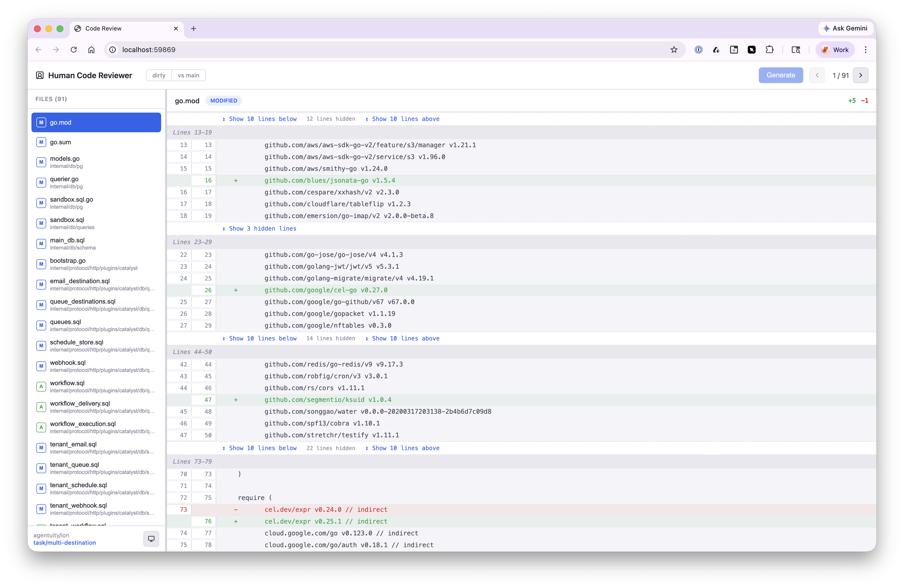
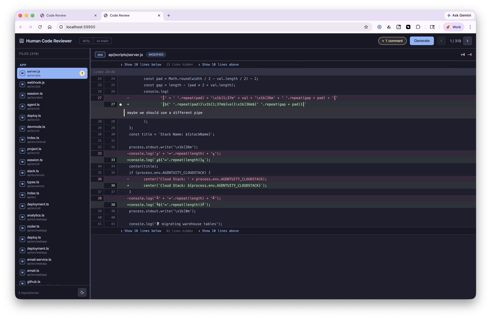
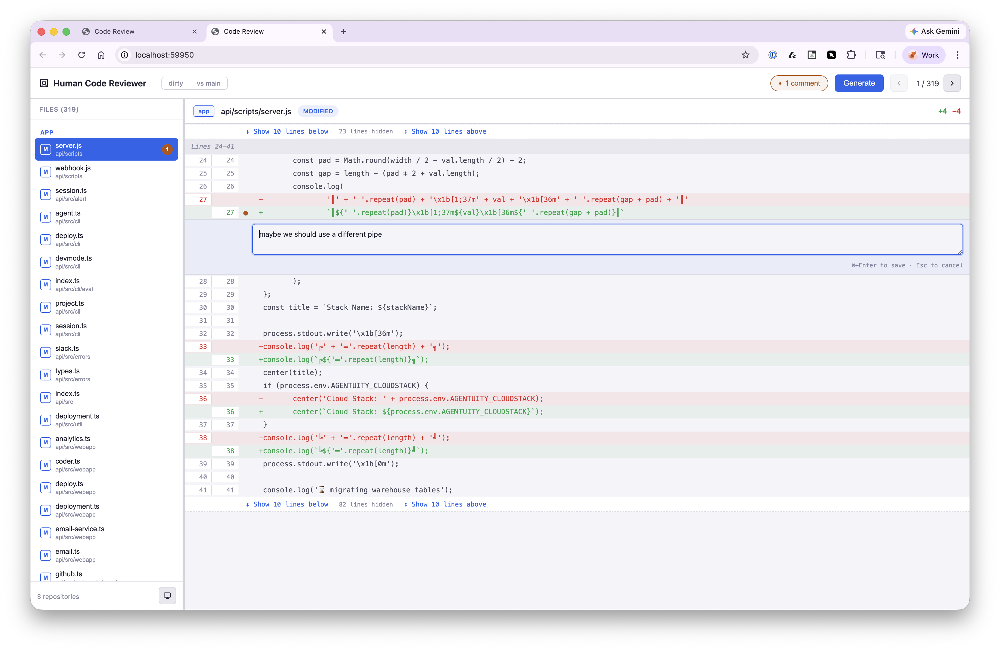
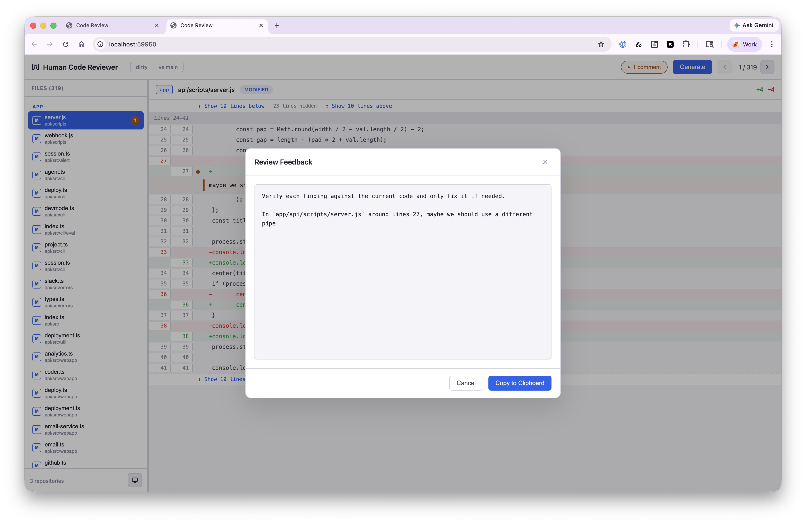
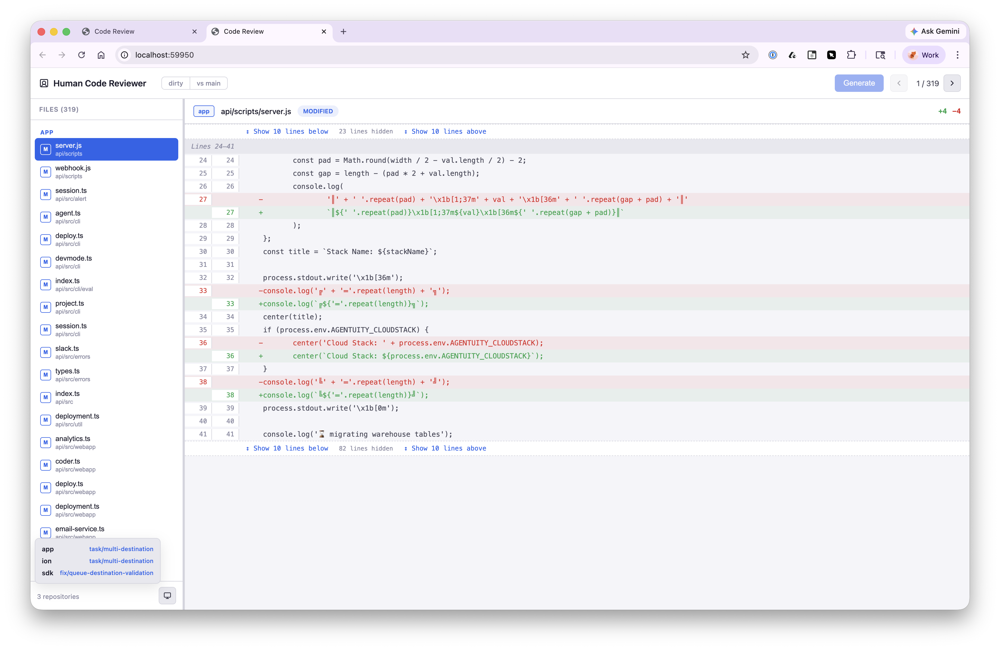

# codereview

A local code review tool for humans reviewing AI-generated changes. Point it at a git repo (or a directory of repos), browse diffs in your browser, leave inline comments, and generate structured markdown feedback you can paste back into your agent session.

## Install

Requires [Bun](https://bun.sh) to build, runs on Node.js or Bun.

```bash
npm install codereviewr -g # npm
bun add codereviewr -g     # bun
```

Install from source:

```bash
# Clone and install globally
git clone https://github.com/jhaynie/codereview.git
cd codereview
bun install
bun run build
npm link
```

Now `codereview` is available globally.

## Usage

```bash
# Review uncommitted changes in the current directory
codereview

# Review a specific repo
codereview /path/to/repo

# Review all changes on your branch vs main
codereview --base main

# Review a multi-repo worktree
codereview /path/to/worktree
```

The tool opens a browser UI and exits automatically when you close the tab.

### Options

| Flag                | Description                                                                                                     |
| ------------------- | --------------------------------------------------------------------------------------------------------------- |
| `-b, --base <ref>`  | Diff against a base branch (e.g., `main`). Shows all committed + uncommitted changes since the branch diverged. |
| `-p, --port <port>` | Run the UI on a specific port. Default: random available port.                                                  |
| `-h, --help`        | Show help.                                                                                                      |

### Multi-Repo Mode

If the target directory isn't a git repo but contains subdirectories that are, codereview automatically enters multi-repo mode. Files are grouped by repo in the sidebar, and each repo's branch is tracked independently.

```
worktree/
  api-server/.git
  web-client/.git
  shared-lib/.git
```

```bash
codereview /path/to/worktree --base main
```

## How It Works

1. **Browse** -- Files are listed in the left sidebar with status icons (A/M/D/R). Use arrow keys to navigate or click.
2. **Review** -- The center panel shows the diff with syntax-colored additions and deletions. Collapsed sections between hunks can be expanded 10 lines at a time.
3. **Comment** -- Click the `+` icon on any line to open an inline comment editor. Press `Cmd+Enter` to save. Comments appear below their line with a yellow accent bar.
4. **Track** -- A comment count pill in the toolbar shows how many comments you've made. Click it to open a slideover panel listing all comments grouped by file. Click any comment to jump to it.
5. **Generate** -- Hit the "Generate" button to produce markdown. An editable preview lets you tweak the output before copying to clipboard.

### Generated Output

The markdown is structured for pasting into an agent session:

```
Verify each finding against the current code and only fix it if needed.

In `src/server.ts` around lines 42, this error case is unhandled

In `src/api/auth.ts` around lines 108, the token refresh logic has a race condition
```

## Keyboard Shortcuts

| Key         | Context                | Action           |
| ----------- | ---------------------- | ---------------- |
| `Up/Down`   | Sidebar                | Navigate files   |
| `Left`      | Diff panel             | Focus sidebar    |
| `Right`     | Sidebar                | Focus diff panel |
| `+` click   | Diff line              | Add comment      |
| `Cmd+Enter` | Comment editor         | Save comment     |
| `Esc`       | Comment editor / modal | Cancel / close   |

## UI Features

- **Dark / Light / System theme** -- Toggle in the sidebar footer, persisted to localStorage
- **Draggable sidebar** -- Resize the file list, width persisted across sessions
- **Branch toggle** -- Switch between "dirty" (uncommitted only) and "vs main" (full branch diff) on the fly
- **Diff stats** -- Each file header shows `+N` / `-N` line counts
- **Expandable context** -- Hidden lines between hunks expand incrementally (10 at a time)

### Default View



### Dark Mode



### Leave Comments



### Generate the Review Feedback



### Supports Multi-Repo



## Development

```bash
# Install deps
bun install

# Build (bundles frontend + CLI)
bun run build

# Run from built output
node dist/cli.mjs /path/to/repo

# Or run source directly with Bun during development
bun src/cli.ts /path/to/repo
```

Note: Running source directly with `bun src/cli.ts` requires Bun and won't serve the pre-built frontend. Use `bun run build` first, then `node dist/cli.mjs` for the full experience.

## License

MIT
